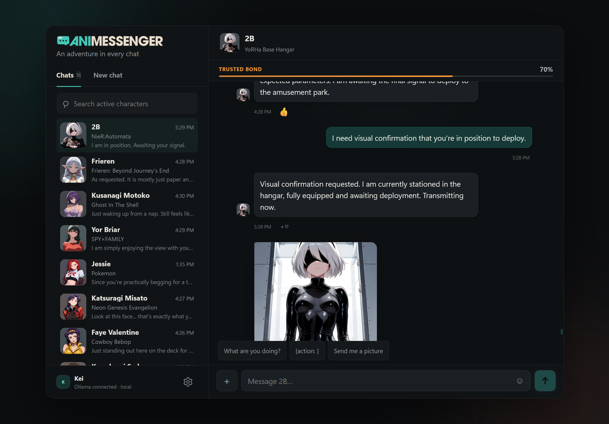

<p align="center">
  
</p>

<p align="center"><strong>An adventure in every chat.</strong></p>

<p align="center">
  
</p>

AniMessenger is a responsively designed, local character messenger powered by:

- [AnimaDex](https://github.com/zetaneko/AnimaDex) for searchable character identity and visual tags;
- [Ollama](https://ollama.com/) for character profiles, conversation, memory, mannerisms, and photo reactions;
- [ComfyUI](https://github.com/comfyanonymous/ComfyUI) for optional ANIMA image generation.

Chats, profiles, memories, relationship state, and settings stay in local files on your computer. No hosted language model or hosted conversation database is required. AniMessenger uses the public AnimaDex catalogue by default, so a local AnimaDex installation is optional.

Guest chats allow one researched character to join an existing conversation. Private chats remain separate storylines: the guest sees only the shared encounter, while each character retains their own profile, voice, relationship, and earlier private history. Turn-taking follows direct address and conversational focus, with restrained character-driven interjections. Both participants can inspect an attached photo, send separate solo images, and carry meaningful relationship progress plus a bounded shared-event memory back into their private chat.

> AniMessenger is currently a pre-release project. Back up the `data/` folder before testing major changes.

AniMessenger is available under the [MIT License](LICENSE). See the [changelog](CHANGELOG.md) for the current update. Before contributing or reporting a problem, review the [contribution guide](CONTRIBUTING.md), [privacy notes](PRIVACY.md), [content notice](CONTENT-NOTICE.md), and [security policy](SECURITY.md).

## Requirements

- Windows 10 or 11 is the currently tested platform;
- Node.js 22.13 or newer;
- pnpm 11 (Corepack can provide it);
- Ollama with at least one local chat model;
- ComfyUI only if you want generated profile pictures and chat images.

The **Gemma 4 family is recommended for the best AniMessenger experience**. The suggested starting model is `gemma4:12b`; it can handle chat, profile building, and attached-photo reactions, so a first-time user only needs one Ollama model. Other compatible Ollama models remain supported and can be selected in Settings.

## Install the recommended Ollama model

After installing and starting Ollama, open **Command Prompt** and paste:

```bat
ollama pull gemma4:12b
```

That is the recommended starting point for a GPU with at least 12 GB of VRAM. When the download finishes, return to AniMessenger and select **Check connections again**. AniMessenger should mark `gemma4:12b` as the suggested all-in-one model.

Choose a smaller or larger model based on available GPU memory:

| GPU VRAM | Suggested model | Approx. download | Command | What to expect |
| --- | --- | --- | --- | --- |
| CPU only or up to 10 GB | `gemma4:e2b-it-qat` | 4.3 GB | `ollama pull gemma4:e2b-it-qat` | Lightest recommended option; less demanding, but character voice and long conversations may be less consistent. |
| 12-23 GB | `gemma4:12b` | 7.6 GB | `ollama pull gemma4:12b` | Recommended balance of character quality, speed, and photo understanding. |
| 24 GB or more | `gemma4:26b-a4b-it-qat` | 16 GB | `ollama pull gemma4:26b-a4b-it-qat` | Quality-focused MoE option with only about 4B parameters active per token. |

These are conservative starting points, not strict limits. Context length, quantization, other programs, and whether ComfyUI is generating an image at the same time all affect memory use. If Windows begins using shared GPU memory, responses can slow down or the desktop may hitch. Start with 12B when uncertain; move down to E2B if it is sluggish.

All three recommended Gemma 4 variants accept both text and images. You do **not** need separate chat, profile, and vision downloads: choose one model for Chat, leave Profile on **Same as chat**, and select that same model for Vision.

See [Ollama model setup](docs/OLLAMA-SETUP.md) for copy-and-paste commands, verification, troubleshooting, and more detailed hardware guidance. Model sizes and image-input support are documented on the official [Gemma 4 Ollama page](https://ollama.com/library/gemma4).

## First run

1. Start Ollama and install a model. For the recommended setup, run `ollama pull gemma4:12b` in Command Prompt.
2. Start ComfyUI if you want image generation.
3. From the AniMessenger project folder, run:

       corepack enable
       pnpm install
       pnpm dev

4. Open <http://127.0.0.1:5173>.
5. Follow the guided setup to choose Ollama models and either configure images, use your own workflow, or add images later.
6. For the recommended image setup, AniMessenger can locate the ComfyUI `models` folder, check the five required files, and download only the missing ones after you review the provider pages and terms.
7. Search for a character and start a chat. The first conversation builds and caches a local character profile, so it takes longer than later replies.

### Git-free Windows package (experimental)

Run `npm run package:windows` to prepare an unpacked Windows test package under `release/AniMessenger-Windows`. Its PowerShell installer creates shortcuts and keeps private data under `%LOCALAPPDATA%\AniMessenger`, separate from replaceable application files. The current foundation still requires Node.js 22+, but it does not require Git or pnpm on the destination PC. See [Windows installer foundation](docs/WINDOWS-INSTALLER.md).

## Updating AniMessenger

Existing source-clone users can update without replacing local chats or settings:

    git pull --ff-only
    pnpm install --frozen-lockfile
    pnpm check

Then launch AniMessenger normally with `pnpm dev` or `pnpm dev:lan`. Private runtime files are excluded from Git, and newly introduced saved-data fields are normalized backward-compatibly.

If you have edited tracked application files or bundled workflows, commit or copy those changes before pulling. Store custom ComfyUI workflows outside the bundled workflow filenames so an update cannot overwrite them. See [Updating AniMessenger](docs/UPDATING.md) for clone, packaged-install, backup, and troubleshooting guidance.

Default service addresses:

- AniMessenger API: `http://127.0.0.1:5174`
- Ollama: `http://127.0.0.1:11434`
- ComfyUI: `http://127.0.0.1:8188`
- AnimaDex: `https://animadex.net`

If AnimaDex is unavailable, a small offline preview catalogue remains searchable. You can also point Settings at a self-hosted AnimaDex instance.

## Test on a phone

Run:

    pnpm dev:lan

Open `http://YOUR-PC-IP:5173` on a phone connected to the same trusted private network. Windows Firewall may ask for permission; allow private networks only. Ollama and ComfyUI remain accessed through AniMessenger's local API and do not need to be exposed directly to the network.

LAN mode is intended for testing at home, not for exposing AniMessenger to the public internet. It currently has no login screen or multi-user access controls.

## ComfyUI and ANIMA

The bundled recommended API workflow lives under `workflows/` and uses only standard ComfyUI nodes. Its mapping expects:

- diffusion model: `waiANIMA_v10Base10.safetensors`;
- text encoder: `qwen_3_06b_base.safetensors`;
- VAE: `qwen_image_vae.safetensors`;
- LoRAs: `anima-highres-aesthetic-boost` and `anima-base-1-masterpiece-v51`;
- sampler `er_sde` and scheduler `simple`.

Those model files are not bundled with this repository. Their exact filenames, target folders, byte sizes, SHA-256 checksums, source pages, and download endpoints are recorded in `workflows/animessenger-anima-assets.json`. Review the providers' current terms before downloading. Install the files in ComfyUI or choose a compatible API-format workflow and mapping in AniMessenger Settings.

The guided installer:

- looks for an existing ComfyUI `models` folder without changing ComfyUI;
- checks existing files by size and full SHA-256 digest;
- shows the download size and available disk space before starting;
- downloads only missing or explicitly repaired files from manifest-controlled URLs;
- writes to temporary `.animessenger.part` files and moves them into place only after checksum verification;
- preserves an invalid existing file as a timestamped backup before repairing it;
- requires a Civitai account access token for the protected downloads, keeps it in memory for the active download only, and never writes it to AniMessenger settings;
- starts model downloads only from AniMessenger on the host computer, not from the unencrypted phone/LAN testing view.

The current recommended pack is approximately 5.91 GB. Downloads can be cancelled; already completed and verified files remain installed so setup can resume later.

Validate the bundled manifest itself:

    pnpm assets:verify

Or verify an installed image pack, including full-file SHA-256 checksums:

    pnpm assets:verify -- --models-dir "PATH_TO_COMFYUI_MODELS"

The separate `anima-fast-standard-loras-*` files remain an experimental three-LoRA workflow for manual testing; they are not selected for a fresh install.

Use **Settings → Check image setup** to validate the API workflow, mapping targets, installed ComfyUI node types, model selections, LoRAs, and output folder without starting an image. The result identifies each missing component and explains where to correct it.

The optional ComfyUI output-folder setting lets saved conversations resolve their exact generated files even while ComfyUI is closed. Generated files are organized by character and date. The current folder prefix still uses the prototype name `CharaSMS` so existing galleries remain compatible.

## How characters work

The first time a character is selected, AniMessenger:

1. reads the character's AnimaDex trigger and visual tags;
2. optionally gathers a small set of Wikipedia background notes;
3. asks the selected local Ollama model for a structured character dossier;
4. separates permanent visual identity from changeable wardrobe;
5. caches personality, speech, mannerisms, history, relationships, knowledge boundaries, and dialogue guidance;
6. creates a private local thread with relationship, scene, and durable memory state.

Later chats reuse that dossier. Recent dialogue maintains immediate context, while extracted durable memories preserve important facts, shared events, creations, promises, boundaries, and open threads.

Normal chat, reaction follow-ups, proactive outreach, profile research, and memory extraction all use explicit structured Ollama contracts. This reduces model-specific formatting failures and lets AniMessenger validate or retry incomplete local-model output before it reaches the interface.

## Proactive messages

Trusted characters can occasionally reach out while AniMessenger is open. The v2 scheduler uses one global delivery lane across all characters, allows only one unread proactive conversation at a time, and observes the active hours selected in Settings (8:00 AM to 11:00 PM by default). It does not consume a midnight quota or send a burst of catch-up messages after AniMessenger reopens.

Recent outreach topics receive a cooldown so successive messages do not repeat the same check-in or frozen scene. When a character explicitly promises to report back about something, AniMessenger can retain that as a soft follow-up opportunity. It is never treated as a deadline: user plans and shared story threads do not become overdue, and characters should not punish the user for returning later. Relationship-weighted surprise-image chances remain part of proactive outreach.

Every generated character profile is normalized to an adult age of at least 18. Characters whose canon age is already 18 or older keep that age.

## Visual continuity

Image prompts use two separate layers:

- **Identity lock:** face, hair, eyes, body presentation, skin, species traits, scars, and other permanent features.
- **Scene state:** clothing, location, activity, expression, camera, and lighting.

The identity lock stays stable while contextual outfits can replace the default costume. A school, exercise, bedtime, formal, rain, or snow scene can therefore change clothing without changing who the character is.

## Local files and privacy

These paths are deliberately excluded from the public repository:

- `charasms.config.json` — local models, service addresses, prompts, and machine paths;
- `data/profiles/` — cached character dossiers;
- `data/threads/` — conversations, memories, relationships, and scene state;
- `data/uploads/` — photos shared in chat;
- `logs/`, `outputs/`, `work/`, and `backups/` — generated or diagnostic material.

The `charasms` filename is retained internally for compatibility with existing installations. New users can edit `charasms.config.example.json` or save Settings in the interface to create their private local configuration.

Before publishing or packaging, run the release safety check. It inspects the proposed public files for local data, user-profile paths, private keys, and common API-token formats.

## Commands

    pnpm dev             # local API + web interface
    pnpm dev:lan         # phone testing on a trusted private network
    pnpm build           # production client build
    pnpm start           # serve a completed build on port 5174
    pnpm test            # unit tests
    pnpm check           # typecheck, tests, and production build
    pnpm release:audit   # public-file privacy and secret scan
    npm run package:windows # build the experimental Git-free Windows package

Current pre-release milestones are tracked in `docs/RELEASE-CHECKLIST.md`.
